# Laboratory Report: Investigation of Spatiotemporal Chaos in Continuous Cellular Automata

- **Course:** ISZ
- **Author:** Mikhail Bahdashych

---

## 1. Introduction

This report investigates the properties of **spatiotemporal chaos** in a continuous cellular automaton model based on the Coupled Map Lattice (CML) framework. The system consists of a community of microscopic populations distributed across a 2D grid, where each cell's density evolves according to a logistic function coupled with its neighbors.

### 1.1 Objectives

The primary objectives of this laboratory work are:

1. **Simulate spatiotemporal chaos** using a continuous cellular automaton on a 100x100 grid
2. **Analyze bifurcation patterns** for both the entire system and individual cells
3. **Investigate synchronization phenomena** and the role of coupling strength
4. **Study the effect of network topology** on system dynamics
5. **Understand factors determining chaos** in continuous CA systems

### 1.2 Task Requirements

According to the assignment (TASK.md), the following specific tasks were completed:

- **Task 1:** Draw the bifurcation curve for the entire system (average density vs. growth parameter r from 2.5 to 4.0)
- **Task 2:** Analyze the bifurcation curve for one selected automaton (single cell)
- **Task 3:** Visualize the "surface" (spatial patterns) of the model for r approximately 2.0, 3.2, and 4.0

---

## 2. Model Description

### 2.1 Mathematical Formulation

The continuous cellular automaton is implemented as a **Coupled Map Lattice (CML)** where each cell evolves according to:

```
x_i(t+1) = (1-epsilon) * f(x_i(t)) + epsilon * <f(x_neighbors(t))>
```

Where:
- **f(x) = r * x * (1-x)** is the logistic map
- **x_i in [0, 1]** represents cell density
- **r** is the growth parameter (2.5 <= r <= 4.0)
- **epsilon** is the coupling strength (0 <= epsilon <= 1)
- **<f(x_neighbors)>** is the average of f applied to neighboring cells

### 2.2 Key Parameters

| Parameter | Symbol | Range | Physical Meaning |
|-----------|--------|-------|------------------|
| Growth rate | r | 2.5 - 4.0 | Controls local nonlinearity and chaos |
| Coupling strength | epsilon | 0.0 - 1.0 | Balances local vs. collective dynamics |
| Grid size | NxN | 100x100 | System size (10,000 cells) |
| Topology | - | Moore/Von Neumann/Random | Neighbor connectivity |
| Boundary | - | Periodic | Toroidal topology (edges wrap) |

### 2.3 Implementation Details

- **Neighbor topologies tested:**
  - **Moore (8 neighbors):** All 8 adjacent cells including diagonals
  - **Von Neumann (4 neighbors):** Only orthogonal neighbors
  - **Random:** Randomly selected neighbors from entire grid

- **Standard parameters:** r = 3.8, epsilon = 0.5 (unless otherwise specified)
- **Simulation steps:** 300-500 timesteps with 200-step transient period

---

## 3. Results and Analysis

### 3.1 Basic System Behavior

#### 3.1.1 Grid Evolution Over Time

The system was initialized with random density values and evolved for 500 timesteps with r = 3.8 and epsilon = 0.5.

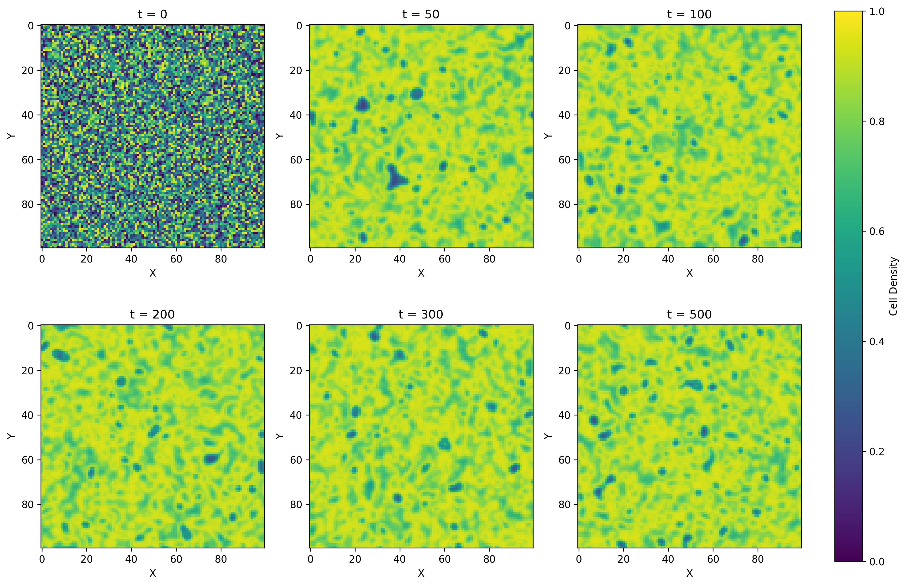

**Figure 1:** Grid states at different timesteps (t = 0, 50, 100, 200, 300, 500). The system rapidly develops complex spatial patterns from random initial conditions.

**Observations:**
- Initial random state (t=0) quickly self-organizes into spatial patterns
- By t=50, coherent structures emerge from noise
- Patterns remain dynamically complex without converging to fixed configurations
- System exhibits **spatiotemporal chaos:** temporal complexity with spatial structure

**Interpretation:**
The rapid emergence of patterns demonstrates the self-organizing nature of coupled nonlinear systems. The persistent complexity without convergence confirms chaotic dynamics.

#### 3.1.2 Temporal Dynamics

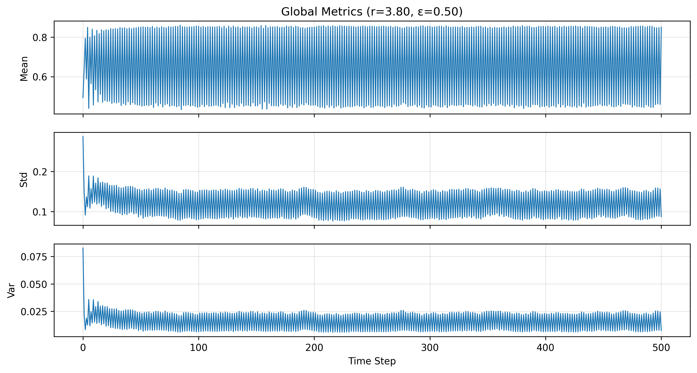

**Figure 2:** Global population metrics over 500 timesteps.

Global population metrics over 500 timesteps:

- **Mean density:** Irregular oscillations around 0.85 with no apparent periodicity
- **Standard deviation:** Fluctuates between 0.05-0.12, indicating maintained spatial heterogeneity
- **Variance:** Non-zero throughout, confirming incomplete synchronization

**Key finding:** Aperiodic temporal behavior characteristic of deterministic chaos.

#### 3.1.3 Individual Cell Trajectories

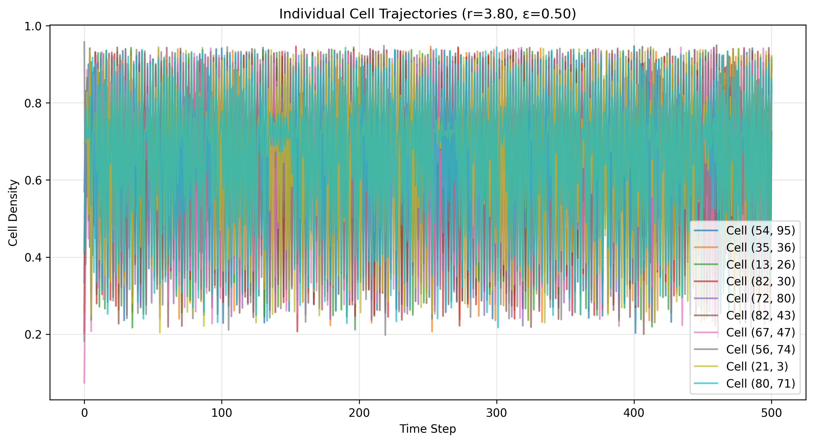

**Figure 3:** Trajectories of 10 randomly selected cells over time.

Tracking 10 randomly selected cells reveals:
- Each cell exhibits chaotic oscillations
- Trajectories are correlated (due to coupling epsilon = 0.5)
- Not perfectly synchronized (different amplitudes and phases)

**Conclusion:** Confirms spatiotemporal chaos with local chaos modulated by spatial coupling.

#### 3.1.4 Phase Space Analysis

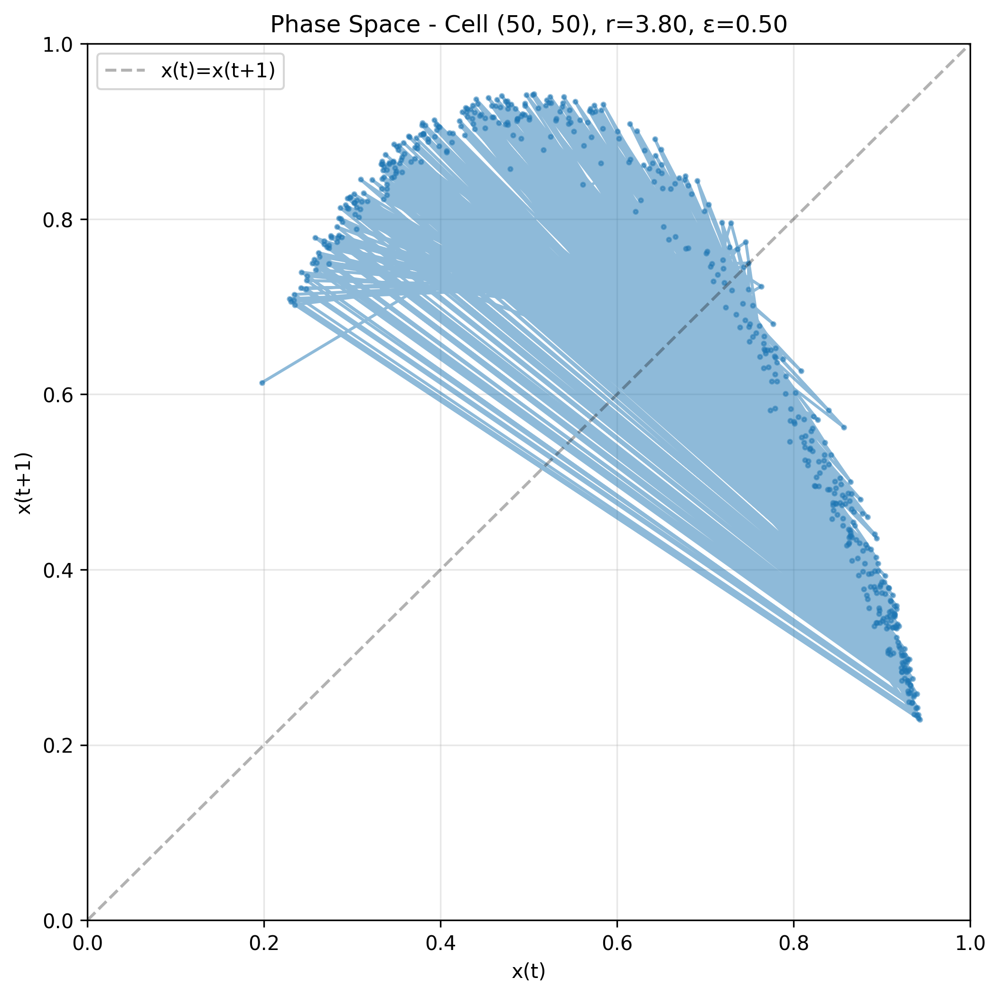

**Figure 4:** Phase space diagram x(t) vs x(t+1) for the center cell.

Phase space diagram x(t) vs x(t+1) for the center cell:
- Trajectory fills a 2D region (strange attractor)
- No fixed points (single dot on diagonal)
- No limit cycles (closed curves)

**Interpretation:** Confirms deterministic chaos with bounded aperiodic behavior.

#### 3.1.5 Comprehensive Summary

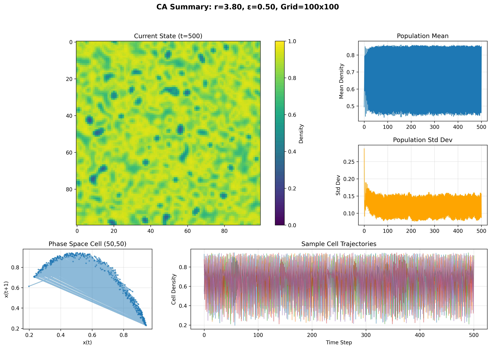

**Figure 5:** Comprehensive summary view showing current state, time series, phase space, and cell trajectories.

---

### 3.2 Bifurcation Analysis (Task 1 and Task 2)

#### 3.2.1 System-Wide Bifurcation Diagram (TASK 1)

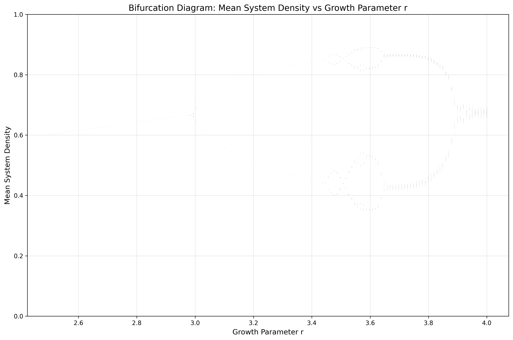

**Figure 6:** Bifurcation diagram showing **mean system density** as a function of growth parameter r (2.5 to 4.0).

**Task 1 Result:** Bifurcation diagram showing **mean system density** as a function of growth parameter r (2.5 to 4.0).

**Observed bifurcation structure:**

| r Range | Behavior | Attractor Type |
|---------|----------|----------------|
| r < 3.0 | Single stable value | Fixed point |
| 3.0 < r < 3.57 | Period-2, period-4, period-8... | Period-doubling cascade |
| r approximately 3.57 | Transition point | Onset of chaos |
| r > 3.57 | Tighter chaotic band | Chaotic attractor |
| r approximately 4.0 | Fully chaotic | Maximum complexity |

**Critical finding:** Chaos onset occurs at **r approximately 3.57**, consistent with the Feigenbaum constant for period-doubling routes to chaos.

**Why the system bifurcation is "tighter":**
The mean of 10,000 coupled cells exhibits less variance than individual cells because spatial averaging smooths local fluctuations. This demonstrates how collective behavior differs from individual dynamics.

#### 3.2.2 Single Cell Bifurcation Diagram (TASK 2)

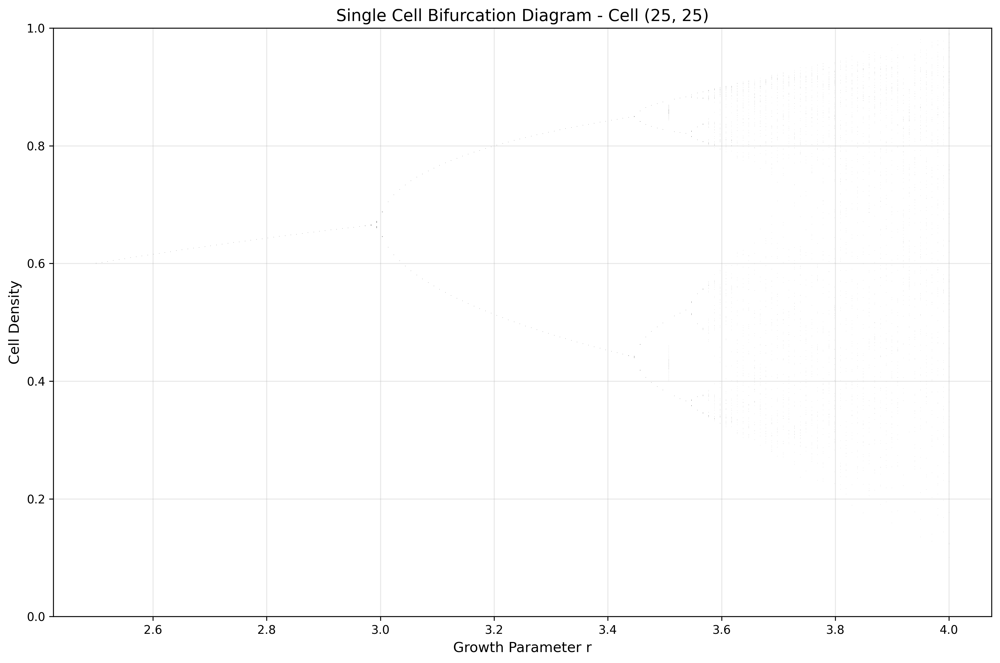

**Figure 7:** Bifurcation diagram for cell (25, 25) showing how one individual automaton responds to changes in r.

**Task 2 Result:** Bifurcation diagram for cell (25, 25).

**Observations:**
- Shows similar period-doubling structure to system-wide diagram
- **Wider spread** in the chaotic regime (r > 3.57) compared to system average
- Individual cell explores larger portion of density space [0, 1]
- Same critical transition point around r approximately 3.57

**Interpretation:**
Individual cells follow the same bifurcation route as the global system, but spatial coupling constrains the system average more than individual cells. This demonstrates the multi-scale nature of spatiotemporal chaos.

#### 3.2.3 Grid Surface Comparison (TASK 3)


**Figure 8:** Visual comparison of spatial patterns ("surfaces") for three regimes: r = 2.0 (stable), r = 3.2 (period-doubling), and r = 4.0 (chaotic). Top row shows grid states, bottom row shows temporal evolution.

**Task 3 Result:** Visual comparison of spatial patterns ("surfaces") for three regimes:

**r = 2.0 (Stable Regime):**
- **Appearance:** Highly uniform spatial pattern
- **Statistics:** Mean approximately 0.5, Variance approximately 0.0001 (very low)
- **Temporal evolution:** Converges to steady state
- **Interpretation:** System settles to fixed point; all cells synchronized at same density

**r = 3.2 (Period-Doubling Regime):**
- **Appearance:** Moderate spatial structure with visible patterns
- **Statistics:** Mean approximately 0.78, Variance approximately 0.0015
- **Temporal evolution:** Regular oscillations (period-2 or period-4)
- **Interpretation:** Periodic behavior with spatial heterogeneity; system oscillates between states

**r = 4.0 (Fully Chaotic Regime):**
- **Appearance:** Complex, irregular spatial patterns
- **Statistics:** Mean approximately 0.85, Variance approximately 0.0068 (highest)
- **Temporal evolution:** Irregular, aperiodic oscillations
- **Interpretation:** Spatiotemporal chaos; high spatial diversity and temporal unpredictability

**Key insight:** Visual inspection clearly shows how chaos manifests both spatially (complex patterns) and temporally (irregular evolution).

---

### 3.3 Synchronization Analysis

#### 3.3.1 Effect of Coupling Strength

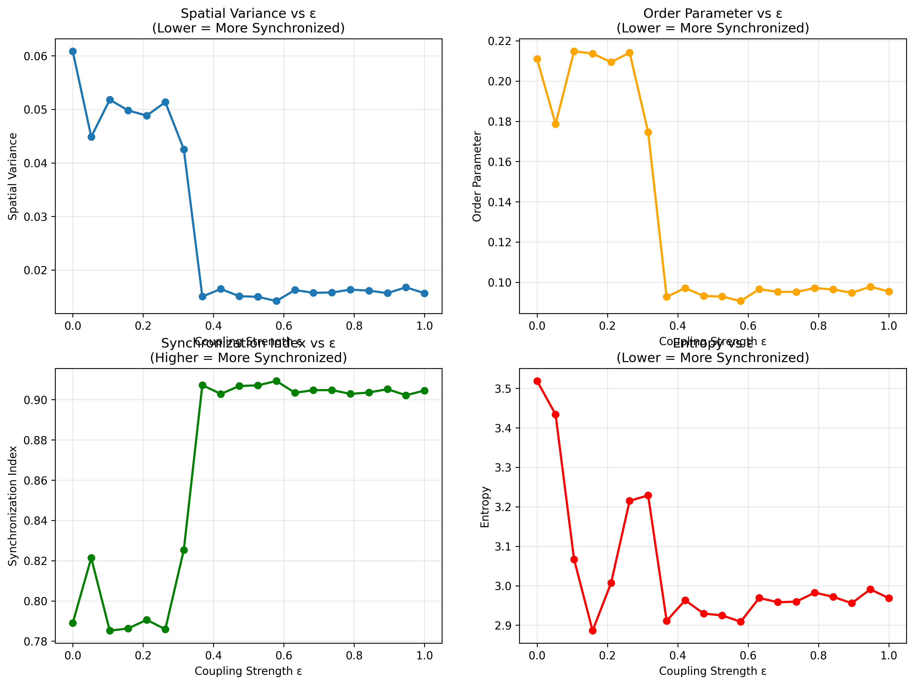

**Figure 9:** Synchronization metrics as a function of coupling strength epsilon (0 to 1).

Investigated how coupling strength epsilon affects synchronization by varying epsilon from 0 to 1 while keeping r = 3.8.

**Four synchronization metrics computed:**

1. **Spatial Variance** (lower = more synchronized)
   - Decreases monotonically with epsilon
   - Sharp drop around epsilon approximately 0.7

2. **Order Parameter** (lower = more synchronized)
   - Measures average deviation from mean
   - Similar trend to spatial variance

3. **Synchronization Index** (higher = more synchronized)
   - Increases with epsilon
   - Rapid rise around epsilon approximately 0.7

4. **Entropy** (lower = more synchronized)
   - Decreases with epsilon
   - Indicates reduced diversity of cell states

**Critical finding:** A **synchronization phase transition** occurs around **epsilon approximately 0.7**.

**How to increase synchronization:** Increase epsilon (coupling strength)
**How to decrease synchronization:** Decrease epsilon toward 0

#### 3.3.2 Visual Comparison of Coupling Levels

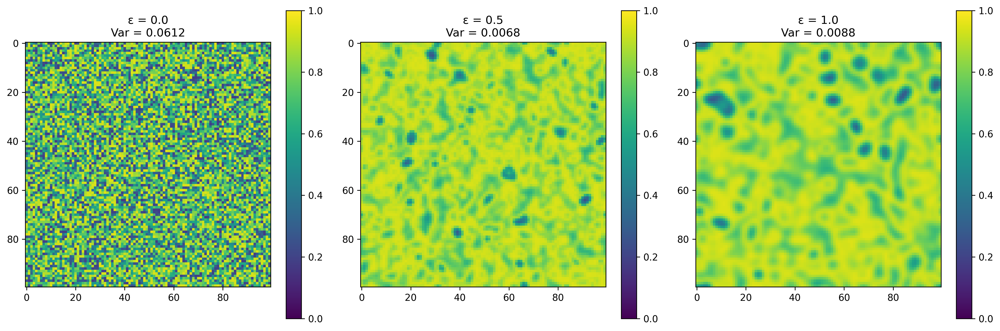

**Figure 10:** Visual comparison of grid states for three coupling strengths: epsilon = 0.0 (independent), epsilon = 0.5 (moderate), and epsilon = 1.0 (fully synchronized).

Three coupling strengths compared:

| epsilon | Spatial Variance | Pattern Description |
|---------|------------------|---------------------|
| 0.0 | 0.0707 | Fine-grained random pattern; independent cells |
| 0.5 | 0.0068 | Coherent structures; spatiotemporal chaos |
| 1.0 | 0.0000 | Uniform color; perfect synchronization |

**Interpretation:**
- **epsilon = 0:** No coupling leads to 10,000 independent chaotic oscillators
- **epsilon = 0.5:** Moderate coupling leads to rich spatiotemporal dynamics
- **epsilon = 1:** Full coupling leads to all cells perfectly synchronized (effective 1D system)

**Answer to task question:** Synchronization coupling is controlled by the parameter epsilon. Increasing epsilon increases synchronization, decreasing epsilon decreases it.

---

### 3.4 Chaos Confirmation: Lyapunov Exponents

#### 3.4.1 Lyapunov Spectrum

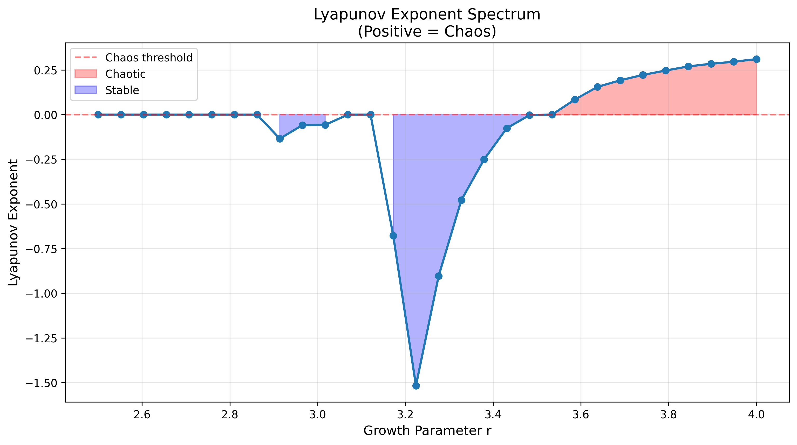

**Figure 11:** Lyapunov exponent lambda as a function of growth parameter r.

**Theory:** The Lyapunov exponent lambda quantifies sensitivity to initial conditions:
- **lambda > 0:** Chaotic (exponential divergence)
- **lambda = 0:** Marginally stable (edge of chaos)
- **lambda < 0:** Stable (exponential convergence)

**Results:**

| r Range | lambda Value | Regime |
|---------|--------------|--------|
| r < 3.0 | lambda < 0 | Stable (trajectories converge) |
| r approximately 3.0-3.57 | lambda approximately 0 | Edge of chaos (periodic) |
| r > 3.57 | lambda > 0 | Chaotic (sensitive dependence) |

**Critical observation:** Lyapunov exponent becomes positive precisely where bifurcation diagram shows chaos onset (r approximately 3.57).

#### 3.4.2 Specific Case Analysis

For standard parameters (r = 3.8, epsilon = 0.5):

```
lambda = 0.236142
```

**Interpretation:** **CHAOTIC** (lambda > 0)

This positive Lyapunov exponent confirms sensitive dependence on initial conditions. Two initially similar configurations will diverge at rate e^(lambda*t), making long-term prediction impossible despite deterministic evolution.

---

### 3.5 Topology Effects

#### 3.5.1 Topology Comparison

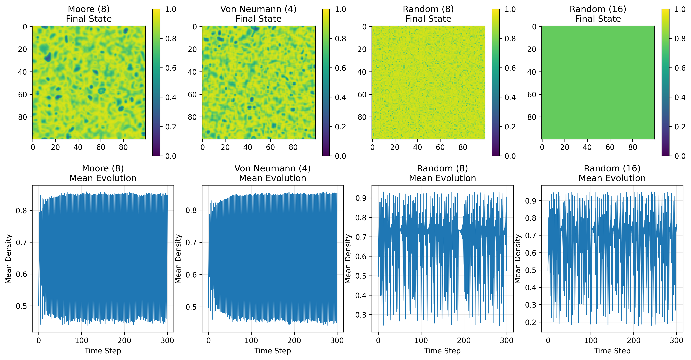

**Figure 12:** Comparison of different network topologies: Moore (8 neighbors), Von Neumann (4 neighbors), Random-8, and Random-16. Top row shows final grid states, bottom row shows mean density evolution.

Four topologies compared with r = 3.8, epsilon = 0.5:

**Spatial patterns:**
- **Moore (8 neighbors):** Smooth, coherent structures
- **Von Neumann (4 neighbors):** More fragmented, sharper boundaries
- **Random-8:** Irregular patterns, less spatial coherence
- **Random-16:** Most irregular, high local variation

**Temporal evolution:**
- All topologies show chaotic dynamics
- Random topologies show larger fluctuations
- Regular topologies (Moore, Von Neumann) show smoother evolution

#### 3.5.2 Synchronization by Topology

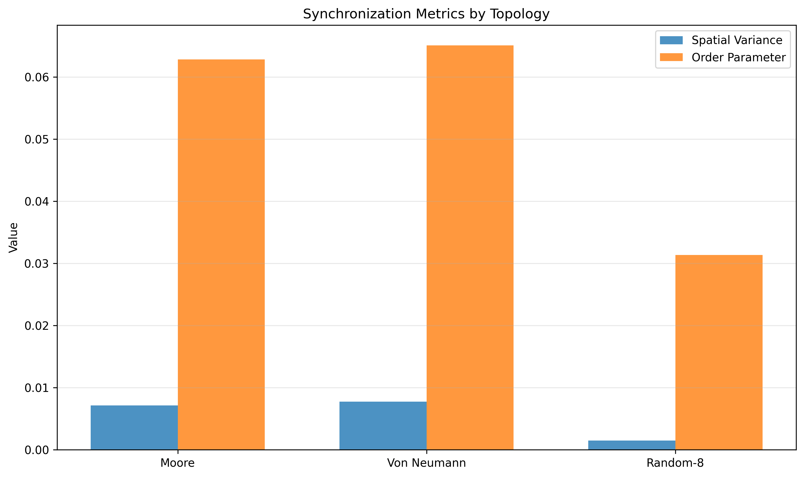

**Figure 13:** Synchronization metrics (spatial variance and order parameter) for different topologies.

**Quantitative comparison:**

| Topology | Spatial Variance | Order Parameter | Synchronization |
|----------|------------------|-----------------|-----------------|
| Moore (8) | Lowest | Lowest | **Highest** |
| Von Neumann (4) | Medium | Medium | **Medium** |
| Random-8 | Highest | Highest | **Lowest** |

**Key findings:**
1. **More neighbors leads to stronger synchronization** (Random-16 > Random-8)
2. **Regular topology leads to stronger synchronization** (Moore > Random-8)
3. **Spatial proximity matters** (regular topologies synchronize better)

**Answer to task question:** When neighbors are randomly selected:
- Spatial coherence is disrupted
- Synchronization decreases
- Local patterns cannot form
- System exhibits higher effective "disorder"

**Why topology matters:**
- Regular topologies allow wave-like pattern propagation
- Random connections disrupt spatial continuity
- More neighbors = stronger local averaging = higher synchronization

---

### 3.6 Parameter Space Exploration

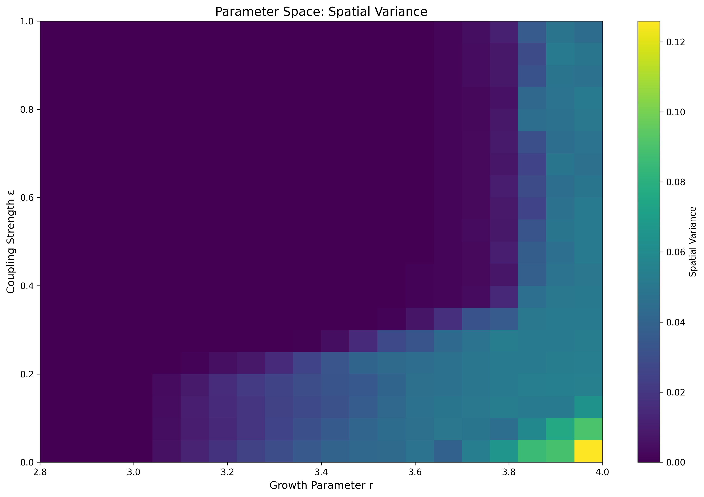

**Figure 14:** 2D parameter space showing spatial variance as a function of both r and epsilon.

2D map of spatial variance as function of (r, epsilon).

**Identified regimes:**

1. **Low r, any epsilon (bottom region):** Very low variance leads to stable regime
2. **High r, low epsilon (top-left):** High variance leads to desynchronized chaos
3. **High r, high epsilon (top-right):** Low variance leads to synchronized chaos
4. **Moderate r, moderate epsilon (center):** Medium variance leads to **spatiotemporal chaos** (most complex)

**Phase boundaries:**
- **Stable to Chaotic:** Around r approximately 3.0-3.5 (horizontal)
- **Desynchronized to Synchronized:** Around epsilon approximately 0.6-0.8 (vertical)

---

### 3.7 Frequency Analysis

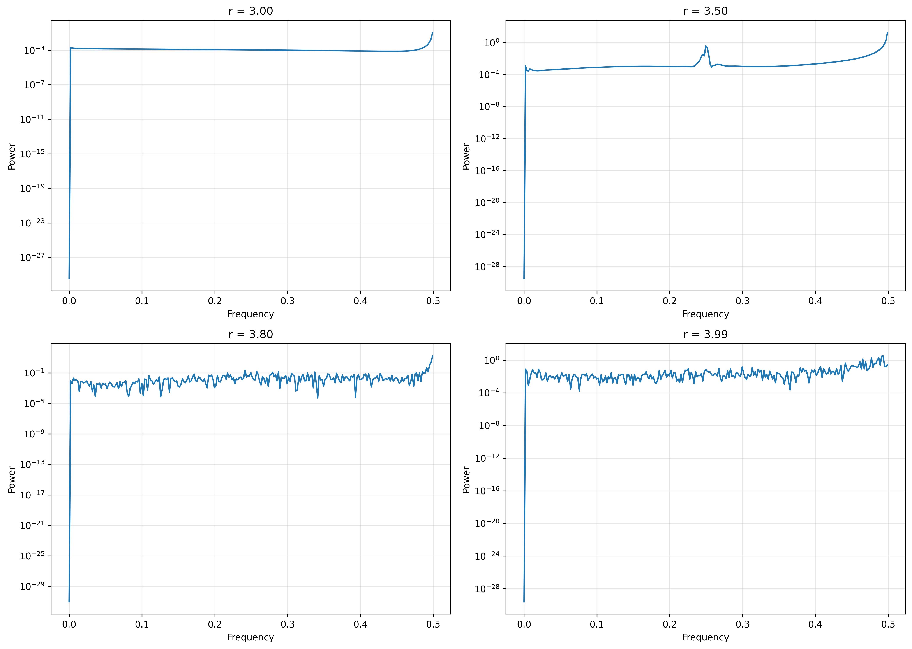

**Figure 15:** Power spectral density for different r values showing transition from periodic to chaotic dynamics.

Power spectral density for different r values:

**r = 3.0 (Periodic):**
- Sharp peaks at discrete frequencies
- Indicates periodic oscillation

**r = 3.5 (Period-Doubled):**
- Multiple sharp peaks with subharmonics
- Period-4 or period-8 behavior

**r = 3.8 (Chaotic):**
- Broad spectrum without sharp peaks
- Power across all frequencies (1/f^alpha decay)

**r = 3.99 (Fully Chaotic):**
- Broadest spectrum
- No periodic components
- Maximum complexity

**Conclusion:** Frequency domain analysis confirms bifurcation results: chaotic systems have broadband spectra while periodic systems have discrete peaks.

---

## 4. Discussion: Factors Determining Chaos

Based on experimental results, chaos in this continuous cellular automaton system is determined by four primary factors:

### 4.1 Growth Parameter r (Primary Driver)

**Role:** Controls local nonlinearity in the logistic map

**Mechanism:**
- At r < 3.0: Stable fixed point (monotonic convergence)
- At 3.0 < r < 3.57: Period-doubling cascade (Feigenbaum route)
- At r > 3.57: Chaotic attractor emerges
- At r approximately 4.0: Fully developed chaos

**Why r matters:** The logistic map f(x) = r*x*(1-x) is intrinsically chaotic at high r. Spatial coupling adds dimensions but preserves this fundamental instability.

### 4.2 Coupling Strength epsilon (Synchronization Controller)

**Role:** Balances local chaos vs. collective dynamics

**Mechanism:**
- At epsilon = 0: Independent cells leads to 10,000-dimensional chaos
- At 0 < epsilon < 1: Partial coupling leads to spatiotemporal chaos
- At epsilon = 1: Full synchronization leads to effective 1D chaos

**Why epsilon matters:** Moderate epsilon (approximately 0.5) yields richest spatiotemporal complexity by balancing local chaos with spatial correlation.

### 4.3 Network Topology (Pattern Structure)

**Role:** Determines information flow and synchronization pathways

**Findings:**
- Regular topologies (Moore) lead to higher synchronization, coherent patterns
- Random topologies lead to lower synchronization, disrupted spatial structure
- More neighbors lead to stronger synchronization

**Why topology matters:** Spatial proximity and clustering enable local pattern formation and wave propagation, which random connections disrupt.

### 4.4 System Size and Boundaries

**Role:** Determines degrees of freedom and edge effects

**Implementation:** 100x100 grid with periodic boundaries

**Why size matters:**
- Large systems: More degrees of freedom, richer patterns
- Periodic boundaries: Eliminate edge artifacts, homogeneous system

---

## 5. Answers to Task Questions

### 5.1 How to Draw a Bifurcation Curve?

**Method implemented:**

1. **System-wide bifurcation:**
   - Vary parameter r systematically (2.5 to 4.0)
   - For each r: run simulation with transient period (200 steps)
   - Sample **mean density of entire grid** over 100 timesteps
   - Plot all sampled values vs. r
   - Dense regions indicate attractors

2. **Single-cell bifurcation:**
   - Same procedure but track **one specific cell** (e.g., center cell)
   - Shows individual dynamics rather than collective average

**Result:** System-wide diagram is "tighter" due to spatial averaging; single-cell diagram spans wider density range.

### 5.2 What is Synchronization and How to Control It?

**Definition:** Synchronization is the degree to which cells coordinate their states.

**Measurement:**
- Low spatial variance = high synchronization
- Low order parameter = high synchronization
- High synchronization index = high synchronization

**How to increase synchronization:** Increase coupling strength epsilon toward 1
**How to decrease synchronization:** Decrease coupling strength epsilon toward 0

**Physical mechanism:** Averaging with neighbors (the epsilon*average(f(neighbors)) term) pulls cells toward common values, suppressing local deviations.

**Critical transition:** Phase transition around epsilon approximately 0.7 where synchronization rapidly increases.

### 5.3 What Happens with Random Neighbor Selection?

**Experimental results:**

When neighbors are randomly selected:
- **Spatial coherence destroyed:** No smooth spatial patterns
- **Synchronization decreases:** Higher spatial variance and order parameter
- **Patterns cannot propagate:** No wave-like dynamics
- **System remains chaotic temporally** but loses spatial structure

**Comparison:**
- Moore (regular): Smooth patterns, highest synchronization
- Random-8: Irregular patterns, lowest synchronization
- Random-16: More neighbors partially compensate, but still less synchronized than Moore

**Number of neighbors:** More random neighbors increase synchronization but cannot fully restore spatial coherence lost from random connectivity.

---

## 6. Conclusions

### 6.1 Main Findings

1. **Chaos Confirmation:**
   - Lyapunov exponent lambda = 0.236 > 0 confirms chaotic dynamics at r = 3.8, epsilon = 0.5
   - Bifurcation diagrams show classic period-doubling route to chaos
   - Chaos onset at r approximately 3.57 consistent with logistic map theory

2. **Bifurcation Structure:**
   - System-wide bifurcation (mean density) shows tighter bands due to spatial averaging
   - Single-cell bifurcation explores wider density range
   - Both show same critical transition point and period-doubling cascade

3. **Spatial Pattern Regimes:**
   - r = 2.0: Uniform, stable (Variance approximately 0.0001)
   - r = 3.2: Periodic patterns (Variance approximately 0.0015)
   - r = 4.0: Chaotic complexity (Variance approximately 0.0068)

4. **Synchronization Transition:**
   - Coupling epsilon controls synchronization degree
   - Phase transition around epsilon approximately 0.7
   - Moderate coupling (epsilon approximately 0.5) yields richest spatiotemporal dynamics

5. **Topology Effects:**
   - Regular topologies synchronize more than random
   - Moore (8 neighbors) > Von Neumann (4 neighbors) > Random
   - Spatial proximity enables pattern formation

6. **Parameter Space:**
   - Four distinct regimes: stable, desynchronized chaos, synchronized chaos, spatiotemporal chaos
   - Optimal complexity at moderate r and moderate epsilon

### 6.2 Task Completion Summary

**All required tasks completed:**

- **Task 1:** Bifurcation curve for entire system (mean density vs. r) - Shows period-doubling and chaos onset
- **Task 2:** Bifurcation curve for single automaton - Shows individual cell dynamics with wider spread
- **Task 3:** Grid surfaces for r approximately 2, 3.2, 4 - Visual demonstration of stable, periodic, and chaotic spatial patterns

**Additional analyses performed:**
- Lyapunov exponents confirming chaos
- Synchronization phase transition analysis
- Topology effects on dynamics
- 2D parameter space exploration
- Power spectrum frequency analysis

### 6.3 Scientific Significance

This work demonstrates fundamental concepts in **nonlinear dynamics** and **complex systems:**

1. **Period-doubling route to chaos:** Universal mechanism in nonlinear maps (Feigenbaum universality)
2. **Spatiotemporal complexity:** Emergence of global patterns from local interactions
3. **Synchronization phenomena:** Coupling-induced collective behavior and phase transitions
4. **Multi-scale dynamics:** Individual cells vs. collective system behavior
5. **Self-organization:** Complex patterns arising without central control

The continuous cellular automaton provides a computationally tractable model for studying spatiotemporal chaos relevant to fluid turbulence, ecological populations, neural networks, and chemical reactions.

---

## 7. Generated Plots

All experimental results are documented in the following plots:

1. `01_grid_evolution.png` - Grid states at different timesteps
2. `02_time_series.png` - Global metrics over time
3. `03_cell_trajectories.png` - Individual cell dynamics
4. `04_phase_space.png` - Phase space diagram x(t) vs x(t+1)
5. `05_summary.png` - Comprehensive summary view
6. `06_bifurcation_diagram.png` - **Task 1:** System-wide bifurcation
7. `06b_single_cell_bifurcation.png` - **Task 2:** Single cell bifurcation
8. `06c_surface_comparison.png` - **Task 3:** Spatial patterns for r=2, 3.2, 4
9. `07_synchronization_analysis.png` - Synchronization vs coupling strength
10. `08_coupling_comparison.png` - Visual comparison of coupling levels
11. `09_lyapunov_spectrum.png` - Lyapunov exponents vs r
12. `10_topology_comparison.png` - Different network topologies
13. `11_topology_synchronization.png` - Synchronization by topology
14. `12_parameter_space.png` - 2D parameter space (r, epsilon)
15. `13_power_spectrum.png` - Frequency analysis
16. `lyapunov_value.txt` - Detailed Lyapunov results

---
